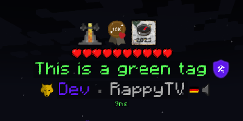

# FAQ

## General

### What do the different role icons mean?
| Icon | Role |
| ---- | ---- |
| { width=32 } | <p style="display: inline-flex;-ms-transform: translateY(25%);transform: translateY(25%);">Admin</p> |
| { width=32 } | <p style="display: inline-flex;-ms-transform: translateY(25%);transform: translateY(25%);">Developer</p> |
| { width=32 } | <p style="display: inline-flex;-ms-transform: translateY(25%);transform: translateY(25%);">Discord Moderator</p> |
| { width=32 } | <p style="display: inline-flex;-ms-transform: translateY(25%);transform: translateY(25%);">Partner</p> |
| { width=32 } | <p style="display: inline-flex;-ms-transform: translateY(25%);transform: translateY(25%);">Financial Supporter / Discord Booster</p> |

### Which commands can I use?

There are several commands to help manage your settings. The main command is `/globaltags`, or you can use the shorthand `/gt`. Here are the available subcommands:

<div class="annotate" markdown>

- **`/gt`** (1) - Displays the current API and Agent versions.
    - **`/gt clearcache`** (2) – Instantly clears your cache.
    - **`/gt renewcache`** (3) – Manually renews the cache.
    - **`/gt link`** (4) – Links your Minecraft account to external connections.
        - **`discord`** - Begins the process to link your Minecraft account with your Discord. Join our <a href="https://globaltags.xyz/discord" target="_blank">Discord Server</a> to complete the connection.
        - **`email <email>`** - Adds an email to receive account-related updates. This is not a newsletter.
    - **`/gt unlink`** (5) – Removes external connections from your Minecraft account.
        - **`discord`** - Unlinks your Minecraft account from Discord.
        - **`email <email>`** - Removes your email from the account.
    - **`/gt verify`** (6) - Verifies specific connections.
        - **`email <code>`** - Verifies your email by entering the confirmation code sent to your inbox.
        
</div>

1. **Base Command**:
    - Alias: `/globaltags`

2. **Clear Cache**: 
    - Alias: `/gt cc`

3. **Renew Cache**:
    - Aliases: `/gt renew`, `/gt rc`

4. **Link Connection**: 
    - No aliases

5. **Unlink Connection**: 
    - No aliases

6. **Verify Connection**: 
    - No aliases

## Tags

### How can I use colors in my Tag?

You can customize your tag with colors using Minecraft's default color codes. To add a color to your tag, simply include the appropriate color code before your text. The codes range from `0-9` for various numbers, and `a-f` for letters, along with additional codes for effects like bold or italic text. 

??? info "All Minecraft color codes"

    Here's a quick reference for Minecraft's color codes:

    - `0` - Black
    - `1` - Dark Blue
    - `2` - Dark Green
    - `3` - Dark Aqua
    - `4` - Dark Red
    - `5` - Dark Purple
    - `6` - Gold
    - `7` - Gray
    - `8` - Dark Gray
    - `9` - Blue
    - `a` - Green
    - `b` - Aqua
    - `c` - Red
    - `d` - Light Purple
    - `e` - Yellow
    - `f` - White
    - `k` - Obfuscated
    - `l` - Bold
    - `m` - Strikethrough
    - `n` - Underlined
    - `o` - Italic

Hex colors are not supported yet, but this feature may be added in the future. To apply these codes, use the `&` symbol followed by the code, like this:

=== ":material-tag-text: Tag"
    ```
    &aThis is a green tag
    ```

=== ":material-image: Result"
    { width=200 }

!!! Note
    Please do **NOT** put spaces after color codes as this will create a whitespace which is a rule violation.

    Do - `&eExample`<br>
    Don't - `&e Example`

### Why can't I include certain words in my Tag?

Certain words, such as "LabyMod", are on a blocklist to prevent users from impersonating staff members. For example, setting your tag to something like `&f&lLabyMod &cModerator` could closely mimic official staff tags. This blocklist helps maintain authenticity and prevents confusion among users.