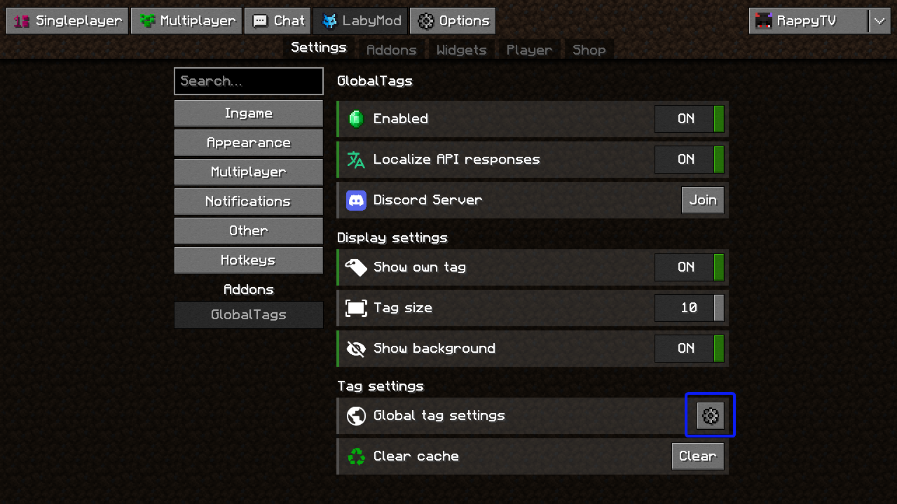

# LabyMod Addon

???+ question "Fun Fact" 
    Did you know that the original idea behind GlobalTags was to create a simple LabyMod addon just for friends? It was later released to the public and expanded to support a wider range of environments!

## Installation

You can easily install the addon by searching for "GlobalTags" in the LabyMod Addon Store. It is available for all versions.

## How to Set a Custom Tag

To create a custom tag, follow these steps:

1. Go to the addon settings.
2. Click the cogwheel icon next to "Global tag settings."

In the settings, you'll see a tag preview and an input field. Enter your desired tag (1), select a position for the tag, choose an icon, and click "Update" to apply the changes.
{ .annotate }

1. You can also use color codes. For more info read [How can I use colors in my Tag?](../faq.md#how-can-i-use-colors-in-my-tag).

---

## How to Appeal a Ban

If you've been banned, it's likely for a significant rule violation, and you'll probably only be granted one second chance. To appeal your ban:

1. Go to the Global tag settings, where you'll see the ban reason and an "Appeal" button.
2. If the appeal button is grayed-out, an admin has disabled appeals for your ban, meaning there may be no option for unbanning.

If the appeal button is clickable, a modal will pop up with an input field. Write your apology or the reason you believe the ban should be lifted, and click "Send appeal." Your appeal will be reviewed, and a decision will be made on whether to lift the ban.

